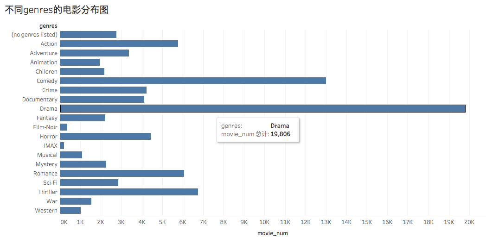
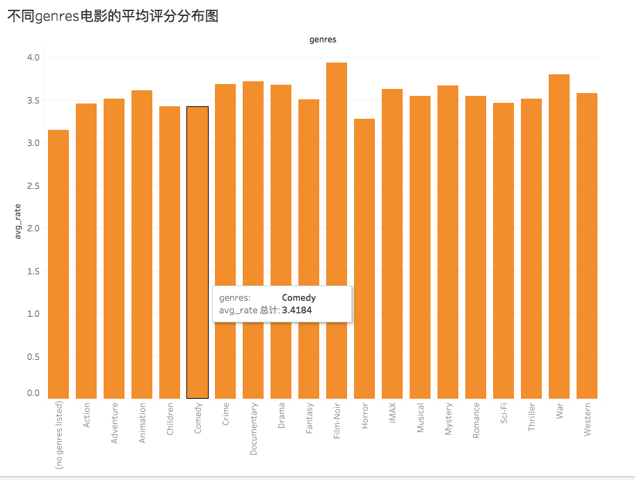
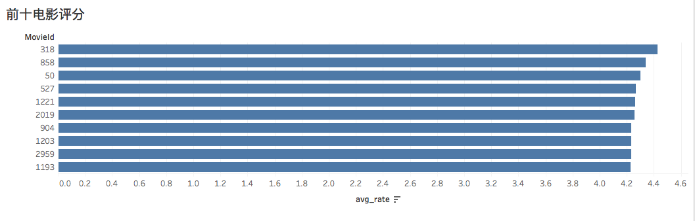
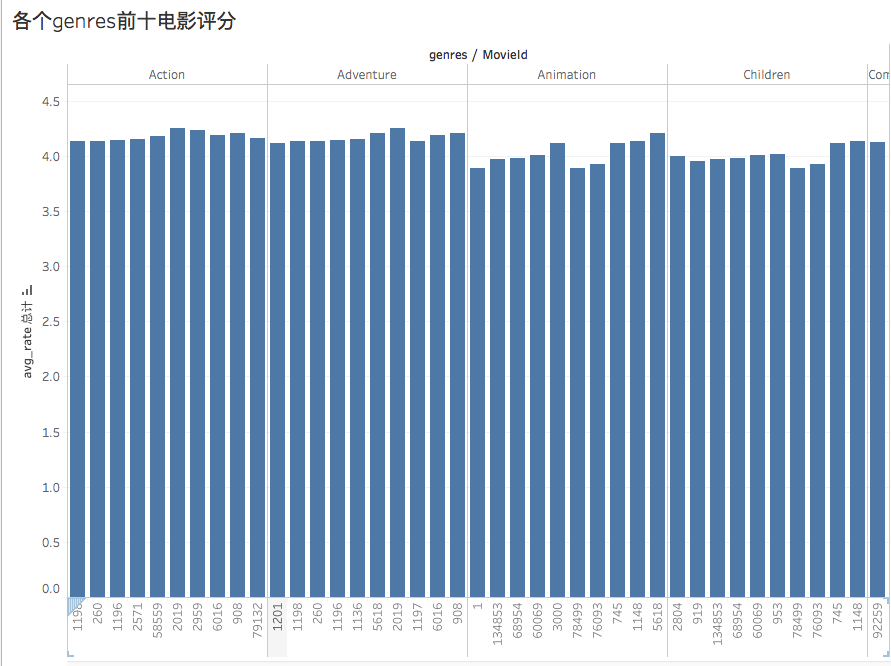
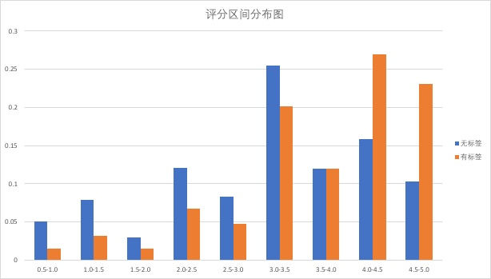

# 成员分工
成员：
* 黄志杰-1500012884
* 周新哲-1500012894
* 易港-1500012890

分工：
* 黄志杰：任务一：数据处理、生成用户电影关联矩阵； 任务二：数据分析
* 周新哲：任务一：生成用户关联矩阵； 任务四：推荐算法
* 易港：任务三： 查询优化
# 数据库设计
数据库名称为movies,在func.sql创建,同时创建了splitall函数，用来切分字符串（主要用于将genres字符串按"|"切分）
在数据库中创建了如下表：

电影信息相关表：

* Movie表：用来暂时存储导入的movie.csv数据，处理完后删除此表；
* MovieMsg表：用来存储每部电影的title和pub_date
* MovieType表：用来存储电影的genres，其中每行为(MovieId,genres)，并且主键设置成(MovieId,genres)，外键为MovieId，参考MovieMsg的主键MovieId。

电影标签相关表：
* Tags_Tmp表: 用来暂时存储导入的tags.csv数据，没有设置主键，处理完后删除此表。
* Tags表: 存储经过处理后的Tags相关信息数据。主键为一个自增序列，外键为MovieId，参考MovieMsg的主键MovieId。

电影评分相关表
* Ratings_Tmp表：用来暂时存储导入的ratings.csv数据，处理完后删除此表。
* Ratings表:存储经过处理后的Ratings相关信息数据。主键为(UserId, MovieId)，外键为MovieId，参考MovieMsg的主键movieId。

矩阵生成相关表：
* MovieSeq表：将MovieId按从小到大的顺序转化为一个连续的序列，每个MovieId对应一个序列号。主键为序列号MSeq, 并为MovieId列增加索引；
* UserSeq表(可选): 将UserId按从小到大的顺序转化为一个连续的序列，每个UserId对应一个序列号。主键为序列号USeq, 并为UserId列增加索引；但是因为数据集的UserId其实连续的，所以其实可以直接使用UserId作为序列号

用户-电影关联矩阵表：
UserMovieMatrix_seq:以用户电影序列号来存储矩阵数据，主键为（USeq,MSeq);
UserMovieMatrix_id(可选): 以用户电影id的形式来存储关联数据(UserId, MovieId);

用户-用户关联矩阵表：

# 数据处理
总体思路：
首先创建一个临时表，每一项和csv中的对应，然后用BULK INSERT将数据导入到临时表；接着对临时表数据进行预处理后导入后续相关表，最后再将临时表删除。

导入数据时遇到的问题及解决方法：
* 1）csv是以","作为分隔符，但有些数据项里面还有","（如title)所以需要在BULK INSERT 加上 FIELDQUOTE = '"'；
* 2）有些tag内容很长，一开始设为200，结果导入数据时报错，最后将tag的长度设为500；

数据预处理：
1）将Movie表中的title分离为title和pub_date:
因为Movie表中title的形式为："标题内容(四位年份)",所以利用patindex找到年份部分，再将前面的作为title，后面的作为pub_date即可，但是有些数据项没有年份部分，所以没有的将pub_date设为null

    SELECT MovieId, (CASE WHEN patindex('%([0-9][0-9][0-9][0-9])%', title) = 0
                THEN title
                ELSE substring(title, 1, patindex('%([0-9][0-9][0-9][0-9])%', title) - 2) end)  as TITLE,
                (CASE WHEN patindex('%([0-9][0-9][0-9][0-9])%', title) = 0
                THEN NULL
                ELSE substring(title, patindex('%([0-9][0-9][0-9][0-9])%', title) + 1, 4) end) as PUB_DATE
    FROM dbo.Movie

2） 将Movie表中的genres处理后导入MovieType表中：
因为这里需要对每一条记录进行逐一处理，所以这里用游标对每一个genres遍历，并利用splitall函数将genres分隔得到一个临时表，再将这个临时表导入MovieType即可。

3）将Tags_Tmp表/Ratings_Tmp表的时间戳转化为日期后导入Tags/Ratings表：
只需要在导入时利用函数：DATEADD(second, RateTime/TagTime, {d '1970-01-01'}) 进行转化即可；
# 数据分析
Query1:统计每个genre下的电影数量；
只需要对MovieType表按照genres进行聚集，统计行数即可；将得到的结果绘制成下图：

其中两个比较突出的是Drama和Comedy；分别是戏剧（不好翻译）和喜剧；两个都破万，而且比其他类型电影，多了至少1倍；

Query2:统计每个genre下电影的平均用户评分；
将MovieType表和Ratings表进行按MovieId连接，然后根据genres聚集，统计每个类别的平均评分即可；将得到的结果绘制成下图：

可以看出，每种类型电影平均评分整体相差不大，但平均最高的电影类型是Film-Noir(黑色电影),也就是那些有黑暗主题和情绪的电影。说明这类电影容易引起人们的共鸣。

Query3:列出观影用户数量超过一定阈值（自定）且平均用户评分排在最高（最低）前十的电影；
首先利用with as语句查询保存观影用户；然后再将MovieMsg和观影用户表进行连接，并过滤得到观影用户超过10,000的电影，然后再将得到的表和UserMovieMatrix_id表连接得到评分前十的电影id和title；
得出的结果如下：

其中，第一名的电影id = 318, 他的title为"Shawshank Redemption, The" 这部电影也就是我们熟知的电影"肖申克的救赎"。

Query4:列出每个genre下观影用户数量超过一定阈值且平均用户评分排在最高（最低）前十的电影
思路和前一个类似，只不过要统计每一类的前十，所以利用了sql server里面的row_number()函数；
得出的结果如下：

因为这个图表比较大，所以只截图前几个类别的前十名电影；

其中Action的第一名是Seven Samurai (Shichinin no samurai)；Google了一下：《七武士》，1954年4月26日上映的日本电影，黑泽明导演的代表作，曾被日本《电影旬报》评为日本影史十大佳片的第一名，并被日本许多评论家认为是日本影史上的最高杰作；好像有点叼，不过我没看过。。而且这部电影在其他许多类别也占据前十（Adventure 第一；Drama 第五）;

Query5:在用户评分过的电影中，有些是打过标签的，有些则没有，比较一下用户在这两类电影评分上的不同;

首先为了比较不同，我先查询了两个类别电影的评分数（因为一个用户可以给多部电影打分，所以行数要比电影数大得多），评分的均值，标准差，评分最大值，评分最小值。结果如下：

|类别|评分数|评分均值|评分标准差|评分最大值|评分最小值|
|:-:|:-:|:-:|:-:|:-:|:-:|
|无标签|190714|1.1723958752106|2.91602346969808|5|0.5|
|有标签|25833575|1.06330397521705|3.53260888204594|5|0.5|
通过这个表可以大致看出两个类别的差别：
1）有标签的电影占了大多数
2）无标签的电影评分均值更高，但两者相差不大；
3）有标签的电影标准差较大，说明评价波动较大；

为了能够进一步比较两个类别的差别，我把评分区间分成9个部分：
0.5-1.0，1.0-1.5，1.5-2.0，2.0-2.5，2.5-3.0，3.0-3.5，3.5-4.0，4.0-4.5，4.5-5.0；
然后分别查询两个类别评分落入上述区间的评分数占各自总数的百分比，最后绘制的结果如下：

从这张图就能更加清楚的看出有标签的电影评分会相对更高，这也符合常理，人们更愿意为好看的电影打标签。这也解释了为何打了标签的电影评分标准差更大。
而无标签的电影评分一般是3.0-3.5；

# 查询优化

# 电影推荐
